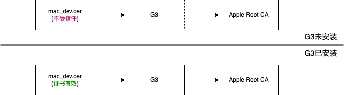

<!--
Date: 2022-09-26
Tags: ["MacOS", "linux"]
Category: Linux
 -->
# codesign命令签名app报错

## 环境

IOS团队同事发过来三个证书：
* mac_development.cer
* mac_distribution.cer
* mac_installer_distribution.cer

双击安装这三个证书安装到电脑后，显示：`证书不受信任`一行红字。为什么会出现不受信任，后文会细说原因。我们先执行codesign命令，对Golang打包的xxx.app进行签名。

## 对app进行签名
```bash
$ security find-identity -v -p codesigning

# --sign 填写证书ID或证书「常用名称」都可以
# --deep 递归签名app内嵌套的helpers, frameworks, and plug-ins包
$ codesign --deep --force --verify --verbose --sign "066...A4" --entitlements entitlements.plist xxx.app
xxx.app: replacing existing signature
Warning: unable to build chain to self-signed root for signer "3rd Party Mac Developer Application: SHANGHAI  & TECH Co. LTD. (xxxxxx)"
xxx.app: errSecInternalComponent

```
使用网上说的各种方法都不生效，包括：
* ~~`security unlock-keychain login.keychain`：输不输入密码都没啥效果，也没有反馈~~
* ~~将证书手动信任，无效~~

## 解决
直到看到这篇文章：[Apple Worldwide Developer Relations Intermediate Certificate Expiration](https://developer.apple.com/de/support/expiration/)

大致是说：中间证书（Intermediate Certificate）过期，需要大伙更新证书。更新证书有两种方式：
1. Xcode 11.4.1及以后的版本，Xcode会自动下载最新的中间证书
2. 手动去页面中提到的[Certificate Authority page](https://www.apple.com/certificateauthority/)手动下载并安装。因为同事证书的颁发机构是：`G3`。在页面中找到这个证书下载、安装到本地电脑上，随之，本地中同事给的证书也变成了可信任的。

重新尝试打包：
```bash
# 头秃了，一个周末两天都在解决这个问题，终于解决了。。。
# --deep，bundle内所有能签名的Framework都会被分别签名
$ codesign --deep --force --verify --verbose --sign "066...A4" --entitlements entitlements.plist xxx.app
xxx.app: replacing existing signature
xxx.app: signed app bundle with Mach-O thin (arm64) [com.xx.xxx]
```

## 注意
签名成功之后，通过spctl命令签名状态，提示`xxx.app: rejected`，但不影响APP在别的机器上安装。

```
$ spctl --verbose --assess --type execute --v xxx.app
xxx.app: rejected
origin=3rd Party Mac...
```
如果需要APP通过签名检测，签名状态为accepted，你还需要通过`xcurn`工具进行公证[^xcrun]。

## 总结
说到证书，有一个关键概念：`信任链`。浏览器不可能保存全世界所有网站的证书，因为太多了无法管理，而且这些证书每天都有新增、修改、删除。伟大计算机先贤的话再次被印证：“Any problem in computer science can be solved by another layer of indirection.”。原来浏览器直接与各个网站的证书关联，现在浏览器只与少数几家CA公司关联，CA公司与各个网站关联。意味着：浏览器信任CA机构，CA机构信任自己颁发的证书。

同事发给我的证书：mac_development.cer，其颁发机构是：G3。对于G3这个机构，我们不知道它是否可信，因为在系统跟证书中没找到它。之后，我下载安装G3证书，G3证书的颁发机构是：Apple
Root CA。果然，在系统根证书中可以找到Apple Root CA。这样就形成了完整的`信任链`。OS信任Apple Root CA，Apple Root
CA颁发了G3，G3颁发了mac_development.cer。

回过头来，前文说的**证书不受信任**的现象也就好理解了，因为信任链断了，颁发证书的机构是G3，系统在本地找不到G3证书。当安装G3证书后，信任链被连起来了。所以同事发过来的证书自动变成：此证书有效。



## 参考
* [^xcrun]: [QT Mac app签名及公证](https://blog.csdn.net/shada/article/details/122704971)
* entitlements文件编写参考：[Entitlement Key Reference](https://developer.apple.com/library/archive/documentation/Miscellaneous/Reference/EntitlementKeyReference/Chapters/EnablingAppSandbox.html)
